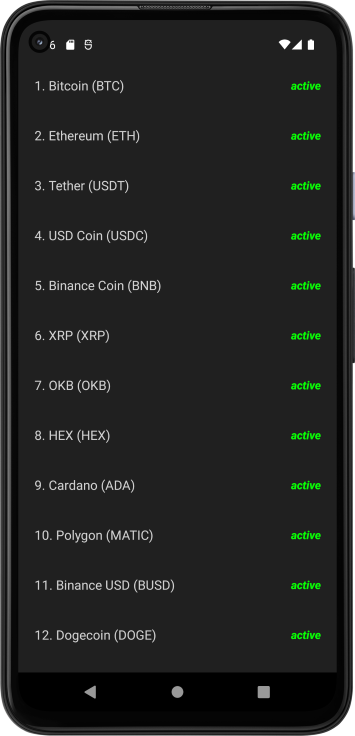
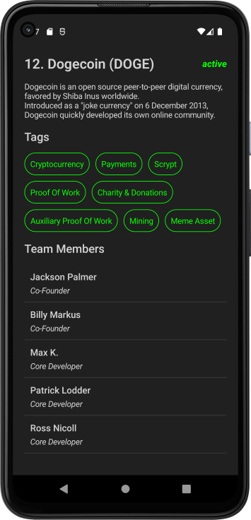

# Crypto Currency App
An app that shows all cryptocurrency from Coin Paprika API in a Scrollable list.
Clicking on an item will fetch more from the api and shows their details.

## We use 
- Clean Architecture, MVVM, Use Cases, Compose, Rest API, Dagger-Hilt, Coroutines)

### Codelab from Philipp Lackner
https://www.youtube.com/watch?v=EF33KmyprEQ&ab_channel=PhilippLackner

- Fixed the Dark/Light Theme.
- Fixed all Dependencies to be current.

  
  

ref: cryptocurrency-app-android-kotlin-compose
